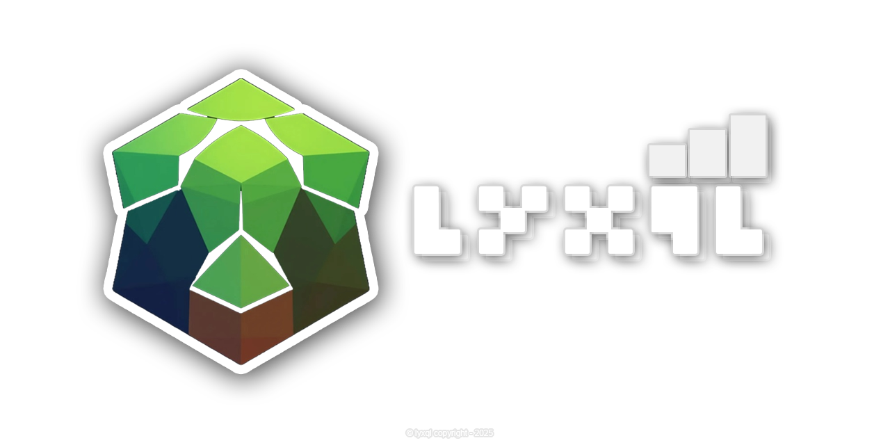

# Welcome to **LYXQL** 🚀

We are a passionate team dedicated to building high-performance, scalable, and flexible database solutions. Our mission is to revolutionize how databases are built and used by providing powerful tools that combine the best of NoSQL and SQL functionality.

At **LYXQL**, we focus on performance, simplicity, and adaptability. Our projects are designed to handle modern data challenges with ease, whether you're building real-time analytics systems, distributed applications, or high-speed caching layers.

Join us in shaping the future of data!

---

## Our Projects 🌟

- **[LYXQL Server](https://github.com/lyxql/lyxql-server)**: A high-performance NoSQL database with full SQL-like functionality, offering fast read/write operations and flexible server configurations.
- **[LYXQL Java-Driver](https://github.com/lyxql/lyxql-java-driver)**: [soon]
- **[LYXQL JDBC](https://github.com/lyxql/lyxql-jdbc)**: [soon]

---

## Get Involved 🤝

We welcome developers, data enthusiasts, and contributors from around the world. If you’re passionate about building the next-generation database solutions, we’d love to have you on board!

- **GitHub**: [https://github.com/lyxql](https://github.com/lyxql)

---

Let’s build something amazing together! 💪
